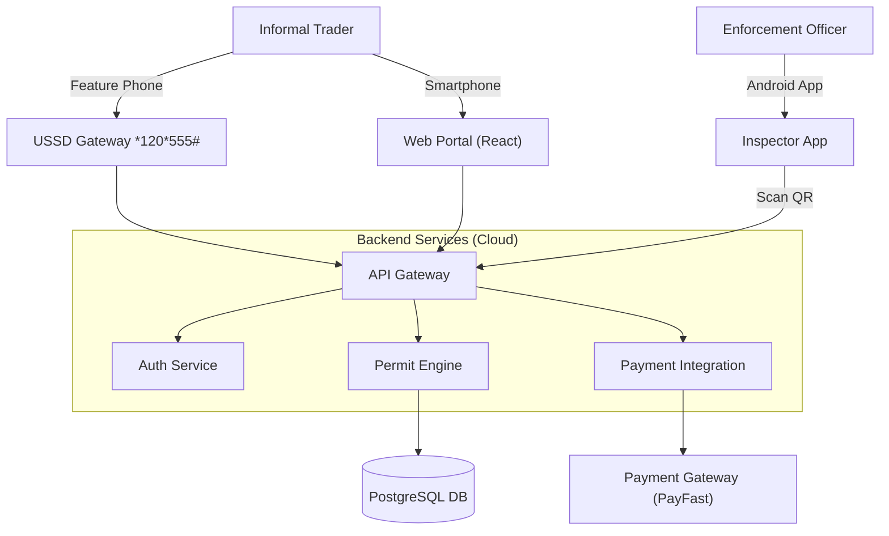

# 🏙️ StreetSmart — Digital Informal Trade Permit System

> **End-to-End Business Analysis & SDLC Portfolio Case Study**
>
> **Status:** 🟢 Complete & Ready for Review
> **Domain:** GovTech / Municipal Services / FinTech

> **Author:** Bheki Mogola — Business Analyst

---

<p align="center">
  
  
  
  
</p>

## 📌 Executive Summary

**StreetSmart** is a realistically designed digital ecosystem for managing informal trader permits within a South African municipality.

This repository serves as a **professional portfolio artifact**. It was engineered independently to demonstrate a comprehensive Business Analysis skillset across the entire Software Development Life Cycle (SDLC)—from initial problem diagnosis and requirement elicitation to system design, testing, and deployment planning.

### 🎯 The "Why": Problem vs. Solution

| ⛔ The Current State (The Problem) | ✅ The StreetSmart Solution (Future State) |
| :--- | :--- |
| **Long Queues:** Vendors wait 3+ hours at offices. | **Remote Access:** USSD & Web Portal for instant renewal. |
| **Cash Risk:** High risk of theft and fraud. | **Cashless:** Integrated mobile payments (PayFast/Ozow). |
| **Fake Permits:** Paper receipts are easily forged. | **Secure Verification:** Encrypted QR codes for validation. |
| **Blind Spots:** No data on zone density. | **Data-Driven:** Real-time analytics & heatmaps. |

---
## 🏗️ Project Artifacts & Deliverables

This repository contains a full **enterprise-grade documentation pack**, structured according to the SDLC phases outlined in the project documentation.

### 📘 Phase 1: Planning & Requirement Analysis
* **Project Charter:** High-level scope, sponsor details, and target delivery dates.
* **Problem Statement:** Analysis of queue times, revenue loss, and manual inefficiencies.
* **Root Cause Analysis:** 5-Whys and Fishbone Diagram (Ishikawa) to diagnose process bottlenecks.
* **Feasibility Study:** Assessment of Operational, Technical, Economic (ROI), and Schedule feasibility.
* **Business Requirements (BRD):** Core business needs and business rules (e.g., Daily/Monthly permits).
* **Software Requirements (SRS):** Functional (FR-01 to FR-08) and Non-Functional requirements (Security, Scalability).
* **Stakeholder Analysis:**
  * **Stakeholder Matrix:** Roles and responsibilities.
  * **RACI Matrix:** Responsible, Accountable, Consulted, and Informed mapping.
  * **Engagement Log:** Pain points, specific needs, and improvement areas.
* **Risk Log:** Mitigation strategies for USSD delays, data breaches, and adoption issues.

### 🧩 Phase 2: System Design
* **Process Modelling:**
  * **AS-IS Swimlane Process:** Current manual workflow analysis.
  * **TO-BE Swimlane Process:** Future digital workflow design.
* **System Architecture:** High-level diagram including USSD, Web, Mobile App, and Cloud Backend.
* **Data Design:**
  * **Database Schema (ERD):** Entity relationships for Vendors, Permits, Inspectors, and Payments.
  * **Data Flow Diagrams (DFD):** Level 0 (Context) and Level 1 (Verification Process).
* **UX/UI Design:**
  * **Site Map:** Navigation structure for Vendor, Inspector, and Admin portals.
  * **Wireframes:** Low-fidelity screens for USSD, Web, and Mobile App.
  * **Use Case Diagram:** Actor-system interaction visualization.
* **User Experience:**
  * **User Stories:** Requirements from the perspective of Vendor, Inspector, and Admin.
  * **Acceptance Criteria (Gherkin):** Detailed "Given-When-Then" scenarios.
  * **User Journeys & Personas:** "Gogo Sarah" (Vendor), "Officer John" (Inspector), and "Thabo" (Admin).

### 💻 Phase 3: Development
* **Technology Stack:** Specifications for Frontend (React/USSD), Backend (Node/Python), and Database (PostgreSQL).
* **Coding Standards:** Documentation and RESTful API guidelines.
* **Integration Points:** API connections for SMS (Twilio), Payments (PayFast), and USSD.
* **Stakeholder Demo Script:** Step-by-step narrative for presenting the MVP to municipal leadership.

### 🧪 Phase 4: Testing
* **Pilot Implementation Plan:** Strategy for the 5-day trial in Zone A with 20 vendors.
* **Test Strategy:** Unit, Integration, and System testing definitions.
* **UAT Test Cases:**
  * Vendor USSD & Web Portal scenarios.
  * Inspector Mobile App scenarios.
  * Admin Dashboard scenarios.
* **UAT Feedback Log:** User feedback categorization (Complaint, Suggestion, Positive).
* **Defect / Bug Report Log:** Tracking of Critical, High, Medium, and Low severity bugs.

### 🚀 Phase 5: Deployment
* **Deployment Readiness Checklist:** Go/No-Go criteria including Code Freeze and SSL validation.
* **Data Migration Plan:** Strategy for cleaning and importing existing vendor data.
* **Training Plan:** Workshops for Inspectors and Town Halls for Vendors.
* **Release Notes (v1.0):** Summary of launched features (USSD channel, verification app).

### 🔧 Phase 6: Maintenance & Support
* **Support Model:** L1 (Call Center), L2 (Technical), and L3 (Developer) structures.
* **SLA (Service Level Agreement):** Response and resolution times for Critical vs. Minor bugs.
* **Future Enhancements:** Roadmap for Vendor Wallets, Heatmaps, and WhatsApp integration.

### 📝 Appendices
* **Glossary of Terms:** Definitions for technical acronyms (API, JWT, POPIA, etc.).
* **Project Sign-Off:** Formal approval from the Project Sponsor and Business Analysis Head.


---
## 🧠 System Architecture (Conceptual)

While this project focuses on analysis, the system was architected with the following data flow in mind:


## 📂 Repository Structure
To explore the documentation, navigate the folders below:
```
StreetSmart/
├── Street-Smart Final Documentation
├── StreetSmart-Digital-Informal-Trade-Permit-System (1)
├── LICENCE.md 
└── README.md
```
## 👤 About the Author
**Bheki Mogola**   

Business Analyst | Data & Business Analytics
I specialize in bridging the gap between business needs and technical solutions. This project showcases my ability to:
- Translate vague problems into concrete technical requirements.
- Document complex systems for both technical and non-technical stakeholders.
- Manage the full lifecycle of a digital product from concept to support.

----
⚠️ Note: This repository is a portfolio case study focusing on Business Analysis artifacts. It contains documentation and design specifications, not executable source code.

